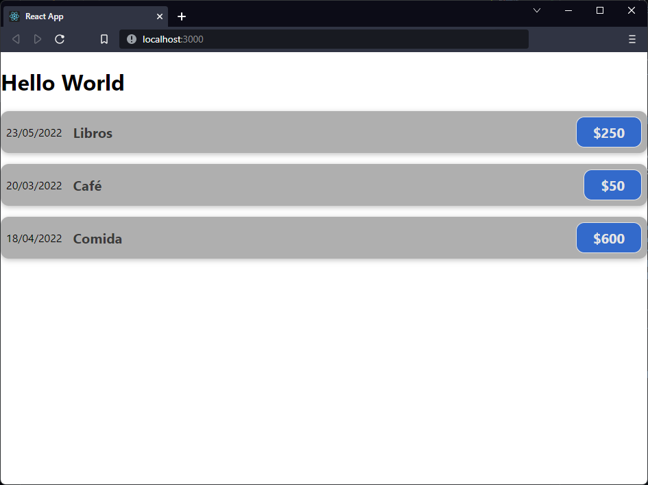

[`React`](../../README.md) > [`Sesión 01: Fundamentos de React`](../Readme.md) > `Ejemplo 02: Props`

---

## Ejemplo 02: Props

### Objetivos

- Construir componentes y pasar datos entre ellos mediante props

### Desarrollo

Ahora vamos a mostrar varios gastos en lugar de uno solo, para que podamos reutilizar nuestro componente `ExpenseItem` necesitamos mover la fecha, descripción y monto al componente `App`, lo haremos en un arreglo para que sea más fácil agrupar la información.

```jsx
import ExpenseItem from "./ExpenseItem";

function App() {
  const expenses = [
    {
      id: Math.random(),
      date: new Date(2022, 4, 23),
      title: "Libros",
      amount: 250,
    },
    {
      id: Math.random(),
      date: new Date(2022, 2, 20),
      title: "Café",
      amount: 50,
    },
    {
      id: Math.random(),
      date: new Date(2022, 3, 18),
      title: "Comida",
      amount: 600,
    },
  ];

  return (
    <div>
      <h1>Hello World</h1>
      <ExpenseItem />
    </div>
  );
}

export default App;
```

> `Math.random()` genera un número aleatorio entre 0 y 1. Normalmente el id es un valor único que proviene de la base de datos donde se encuentra almacenada la información.

Es hora de reutilizar nuestro componente. Para eso vamos a escribir tres veces el componente `ExpenseItem` y les pasaremos los datos de cada gasto. Los `props` son como atributos en las etiquetas HTML:

```jsx
import ExpenseItem from "./ExpenseItem";

function App() {
  const expenses = [
    {
      id: Math.random(),
      date: new Date(2022, 4, 23),
      title: "Libros",
      amount: 250,
    },
    {
      id: Math.random(),
      date: new Date(2022, 2, 20),
      title: "Café",
      amount: 50,
    },
    {
      id: Math.random(),
      date: new Date(2022, 3, 18),
      title: "Comida",
      amount: 600,
    },
  ];

  return (
    <div>
      <h1>Hello World</h1>
      <ExpenseItem
        date={expenses[0].date}
        title={expenses[0].title}
        amount={expenses[0].amount}
      />
      <ExpenseItem
        date={expenses[1].date}
        title={expenses[1].title}
        amount={expenses[1].amount}
      />
      <ExpenseItem
        date={expenses[2].date}
        title={expenses[2].title}
        amount={expenses[2].amount}
      />
    </div>
  );
}

export default App;
```

En nuestro componente `ExpenseItem` debemos agregar el parámetro `props` a nuestra función. Este es un objeto que contiene todos los argumentos que acabamos de pasar desde el componente `App`.

```jsx
import "./ExpenseItem.css";

function ExpenseItem(props) {
  return (
    <div className="expense-item">
      <div>{props.date.toLocaleDateString()}</div>
      <div className="expense-item-description">
        <h2>{props.title}</h2>
        <div className="expense-item-price">${props.amount}</div>
      </div>
    </div>
  );
}

export default ExpenseItem;
```

Con esto ya tenemos un componente mucho más flexible que renderiza el contenido de manera dinámica con la información que recibe del componente padre.


