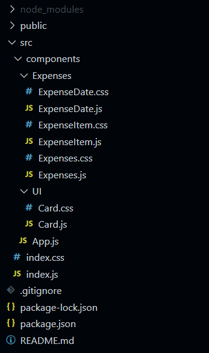

[`React`](../README.md) > `Sesión 01: Fundamentos de React`

---

# Sesión 01 - Fundamentos de React

## 🎯 Objetivos

- Identificar la ventaja de usar React en lugar de Vanilla JavaScript
- Dominar la sintaxis JSX
- Construir componentes y pasar datos entre ellos mediante props
- Mapear listas y renderizar sus elementos

## 🛠 Contenido

### ¿Qué es React?

React es una librebría open source de JavaScript creada por el equipo de Facebook para desarrollar interfaces de usuario. React está basado en componentes, estos son como piezas de lego independientes que se pueden componer para crear interfaces complejas.

### Componentes

Vamos a retomar la instalación que se hizo durante el prework para desarrollar una aplicación que nos permita dominar los conceptos de esta y las siguientes sesiones. La aplicación que vamos a hacer nos permitirá llevar un registro de gastos.

- [`Ejemplo 01`](Ejemplo-01/Readme.md)

Los componentes de React son reutilizables, si queremos ver varios gastos simplemente debemos agregar las veces que necesitemos el componente `<ExpenseItem />`. Además de esto, en el prework vimos que en JSX podemos usar expresiones de JavaScript, y como los componentes son funciones podemos tener lógica dentro del componente antes de realizar el renderizado.

En nuestro componente `<ExpenseItem />` agregamos la fecha, descripción y monto directamente en el JSX, pero podemos crear variables y usar expresiones para crear un componente que sea más flexible:

```jsx
import "./ExpenseItem.css";

function ExpenseItem() {
  const date = new Date(2022, 4, 23);
  const title = "Libros";
  const amount = 250;

  return (
    <div className="expense-item">
      <div>{date.toLocaleDateString()}</div>
      <div className="expense-item-description">
        <h2>{title}</h2>
        <div className="expense-item-price">${amount}</div>
      </div>
    </div>
  );
}

export default ExpenseItem;
```

> El constructor `Date` genera un objeto `Date` que tiene distintos métodos como `toLocaleDateString()` que genera una cadena con una representación de la fecha en el formato indicado. Esto es de JavaScript, no de React.

### Props

Para que los componentes de React puedan ser reutilizables muchas veces es necesario que rendericen contenido dinámico, esto implica que de alguna manera los componentes se deben comunicar o pasar información entre ellos. Los componentes padres pueden pasar información a los hijos mediante los `props`.

- [`Ejemplo 02`](Ejemplo-02/Readme.md)

- [`Reto 01`](Reto-01/Readme.md)

- [`Reto 02`](Reto-02/Readme.md)

### Children Props

Ya tenemos varios componentes para nuestra lista de gastos. En lugar de tener todo en `App` separamos la lógica en componentes más pequeños e independientes que pueden ser reutilizados. A esto se le conoce como **composition**. Sólo nos falta ver un concepto más que forma parte del composition en React y es **children props**. Todos los componentes cuentan con un prop especial que se llama **children** el cual contiene todo lo que se encuentre dentro de las etiquetas del componente.

- [`Ejemplo 03`](Ejemplo-03/Readme.md)

Antes de continuar es momento de revisar nuestro directorio. Hasta ahora hemos creado todo dentro de la carpeta `components`, si seguimos así vamos a terminar con cientos de archivos en una misma carpeta. Para evitarlo vamos a organizar nuestros componentes por lógica, crearemos una carpeta `Expenses` donde pondremos todos los componentes que tengan que ver con el renderizado de gastos y haremos otra carpeta `UI` para componentes generales como `Card`.



> No olvides actualizar las rutas en los imports

### Renderizado de listas

En nuestro componente `Expenses` estamos renderizando `ExpenseItem` varias veces, una por cada elemento del arreglo `expenses`. Esta forma de renderizar nuestra lista no es dinámica, afortunadamente en JSX podemos usar expresiones de JavaScript y renderizar nuestra lista de una mejor manera.

- [`Ejemplo 04`](Ejemplo-04/Readme.md)

## 📝 Postwork

TBD
