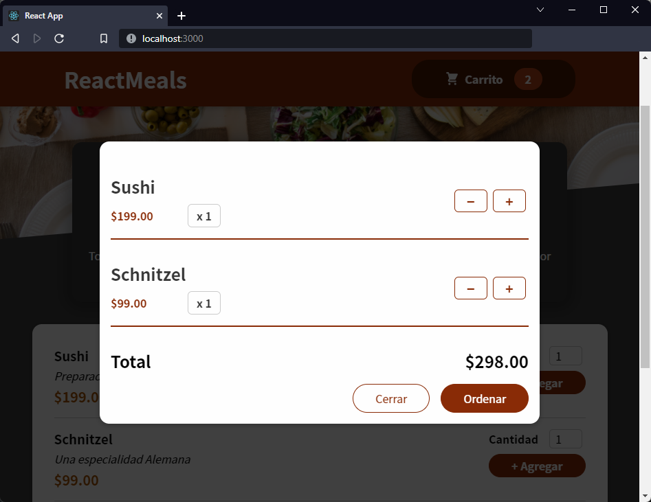

[`React`](../../README.md) > [`Sesión 04: Fragments, Portals y Refs`](../Readme.md) > `Postwork`

---

# Postwork

## 🎯 Objetivos

- Utilizar fragmentos de React para evitar renderizar elementos innecesarios.
- Utilizar portales de React para crear un modal.

## 🛠 Desarrollo

Tu proyecto ya tiene estructura, estilos, y state para manejar cantidades de los platillos. Con lo visto en esta sesión puedes agregar un modal a tu aplicación para mostrar el carrito de compras. Por ahora sólo nos vamos a enfocar en mostrar el modal, más adelante aprenderás a manipular states mucho más complejos desde distintas partes de la aplicación, eso te permitirá modificar el contenido del carrito de compras desde el modal.

Sigue las siguientes instrucciones:

- Revisa nuevamente tu aplicación. Si tuviste que envolver varios elementos dentro de un `
` cámbialos por React Fragments.
- En el `index.html` agrega dos nuevos nodos al mismo nivel del nodo principal donde se renderiza la aplicación. Estos te servirán para crear los portales que necesitas.
- Crea un portal para el `backdrop`, oscurecer la pantalla ayuda a resaltar el modal, recuerda que al hacer click en el backdrop el modal debe cerrarse.
- Crea un portal para el modal, este se debe abrir al seleccionar el carrito. Por el momento puedes mostrar el resumen del carrito de compras dentro del modal pero no te preocupes por modificar las cantidades.

### Imágen de referencia

Recuerda que el diseño de la aplicación es a tu gusto, por lo que los colores y el acomodo de los elementos está completamente a tu criterio. A continuación te mostramos una imágen que te servirá como referencia de lo que llevamos hasta el momento:

