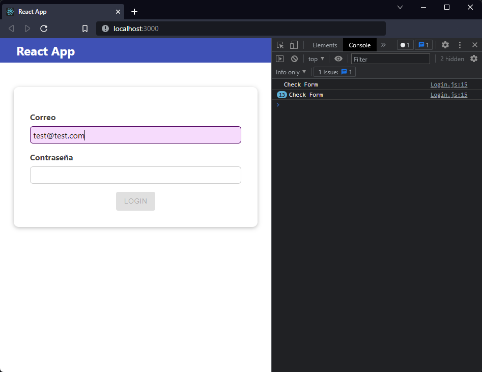
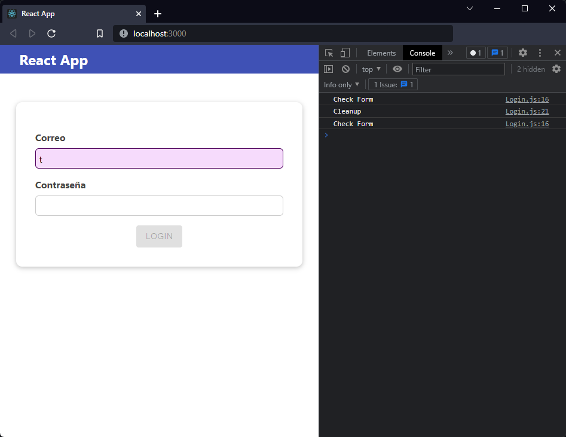
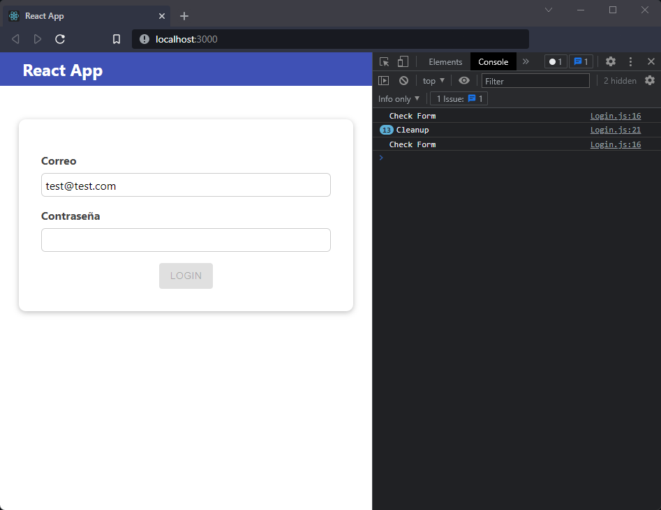

[`React`](../../README.md) > [`Sesión 05: Efectos Secundarios, Reducers y Context`](../Readme.md) > `Ejemplo 02: Limpiando efectos`

---

## Ejemplo 02: Limpiando efectos

### Objetivos

- Limpiar efectos creados con el hook useEffect

### Desarrollo

Con el resultado del [Reto 01](../Reto-01/Readme.md) estamos validando el formulario cada vez que cambia el estado, lo cual ocurre cada vez que presionamos una tecla.

Agreguemos un log en consola para verlo:

```jsx
useEffect(() => {
  console.log("Check Form");
  setFormIsValid(email.includes("@") && password.trim().length > 6);
}, [email, password]);
```



El primer log sucede al momento de renderizar el componente y los otros 13 corresponden a cada letra del correo. Si nuestro efecto necesitara hacer una petición HTTP esto significaría que estaríamos 13 peticiones una por cada letra, lo cual es una operación bastante intensa.

Una buena práctica para estos casos es usar lo que se conoce como _debounce_, básicamente es esperar cierto tiempo antes de realizar una acción. En nuestro caso, no vamos a validar el formulario con cada tecla que se presione, más bien, vamos a esperar un pequeño tiempo después de que el usuario haya terminado de escribir.

```jsx
useEffect(() => {
  setTimeout(() => {
    console.log("Check Form");
    setFormIsValid(email.includes("@") && password.trim().length > 6);
  }, 500);
}, [email, password]);
```

Con este `setTimeout` nos esperamos 500 milisegundos antes de ejecutar el código. Sin embargo, en este momento el resultado es el mismo solo que tardan un poco en aparecer los mensajes en consola.

La función que le pasamos a `useEffect` puede retornar otra función, esta se considera como una **función de limpieza**:

```jsx
useEffect(() => {
  setTimeout(() => {
    console.log("Check Form");
    setFormIsValid(email.includes("@") && password.trim().length > 6);
  }, 500);

  return () => {
    console.log("Cleanup");
  };
}, [email, password]);
```



La función de limpieza se ejecuta antes de que el componente se elimine de la interfaz de usuario para evitar pérdidas de memoria. Además, si un componente se procesa varias veces (como suele hacer), el efecto anterior se limpia antes de ejecutar el siguiente efecto.

En nuestro ejemplo, esto significa que podemos limpiar el `setTimeout` anterior con `clearTimeout` logrando así un _debounce_ para validar el formulario una sola vez 500 milisegundos después de que el usuario terminó de escribir.

```jsx
useEffect(() => {
  const timer = setTimeout(() => {
    console.log("Check Form");
    setFormIsValid(email.includes("@") && password.trim().length > 6);
  }, 500);

  return () => {
    console.log("Cleanup");
    clearTimeout(timer);
  };
}, [email, password]);
```



Ya podemos eliminar los logs, nuestro código completo se ve de la siguiente manera:

```jsx
import React, { useState, useEffect } from "react";

import Card from "../UI/Card/Card";
import Button from "../UI/Button/Button";
import styles from "./Login.module.css";

function Login(props) {
  const [email, setEmail] = useState("");
  const [emailIsValid, setEmailIsValid] = useState();
  const [password, setPassword] = useState("");
  const [passwordIsValid, setPasswordIsValid] = useState();
  const [formIsValid, setFormIsValid] = useState(false);

  useEffect(() => {
    const timer = setTimeout(() => {
      setFormIsValid(email.includes("@") && password.trim().length > 6);
    }, 500);

    return () => {
      clearTimeout(timer);
    };
  }, [email, password]);

  const emailChangeHandler = (event) => {
    setEmail(event.target.value);
  };

  const passwordChangeHandler = (event) => {
    setPassword(event.target.value);
  };

  const validateEmailHandler = () => {
    setEmailIsValid(email.includes("@"));
  };

  const validatePasswordHandler = () => {
    setPasswordIsValid(password.trim().length > 6);
  };

  const submitHandler = (event) => {
    event.preventDefault();
    props.onLogin(email, password);
  };

  return (
    <Card className={styles.login}>
      <form onSubmit={submitHandler}>
        <div
          className={`${styles.control} ${
            emailIsValid === false ? styles.invalid : ""
          }`}
        >
          <label htmlFor="email">Correo</label>
          <input
            type="email"
            id="email"
            value={email}
            onChange={emailChangeHandler}
            onBlur={validateEmailHandler}
          />
        </div>
        <div
          className={`${styles.control} ${
            passwordIsValid === false ? styles.invalid : ""
          }`}
        >
          <label htmlFor="password">Contraseña</label>
          <input
            type="password"
            id="password"
            value={password}
            onChange={passwordChangeHandler}
            onBlur={validatePasswordHandler}
          />
        </div>
        <div className={styles.actions}>
          <Button type="submit" disabled={!formIsValid}>
            Login
          </Button>
        </div>
      </form>
    </Card>
  );
}

export default Login;
```
