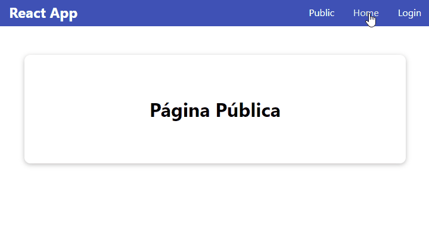

[`React`](../../README.md) > [`Sesión 07: React Router`](../Readme.md) > `Ejemplo 02: Rutas protegidas`

---

## Ejemplo 02: Rutas protegidas

Anteriormente el componente `<Home>` sólo se renderizaba después de iniciar sesión, perdimos esa funcionalidad en el ejemplo anterior. La ruta de este componente `/home` se considera protegida porque la intención es que sólo sea visitada por usuarios autenticados, mientras que la ruta `/` que renderiza el componente `<Public>` puede ser visitado por cualquier usuario.

Empecemos creando una nueva carpeta donde tenemos los componentes, vamos a llamarla `RequireAuth` y como ya sabes vamos a crear un archivo dentro de esta carpeta llamado `RequireAuth.js`:

```jsx
import { useContext } from "react";
import { useLocation, Navigate } from "react-router-dom";
import AuthContext from "../../context/AuthContext";

function RequireAuth({ children }) {
  const { isLoggedIn } = useContext(AuthContext);
  const location = useLocation();

  if (!isLoggedIn) {
    return <Navigate to="/login" state={{ from: location }} replace />;
  }

  return children;
}

export default RequireAuth;
```

Este componente valida que el usuario esté autenticado usando `AuthContext`. Con el componente `<Navigate>` podemos redireccionar al usuario a la ruta `/login` en caso que no se haya autenticado. Con el prop `state` estamos guardando la ruta a la que estaban intentando acceder al momento de ser redirigidos, esto nos permite enviarlos a esa ruta después de iniciar sesión. Ahora debemos volver a `App.js` y usar este nuevo componente para envolver `<Home>`.

```jsx
import React from "react";
import { Routes, Route } from "react-router-dom";
import RequireAuth from "./components/RequireAuth/RequireAuth";
import Login from "./components/Login/Login";
import Home from "./components/Home/Home";
import Header from "./components/Header/Header";
import Public from "./components/Public/Public";

function App() {
  return (
    <React.Fragment>
      <Header />
      <main>
        <Routes>
          <Route path="/" element={<Public />} />
          <Route path="/login" element={<Login />} />
          <Route
            path="/home"
            element={
              <RequireAuth>
                <Home />
              </RequireAuth>
            }
          />
        </Routes>
      </main>
    </React.Fragment>
  );
}

export default App;
```

Ahora solo nos falta redireccionar al usuario después de iniciar sesión. Para esto primero debemos hacer un pequeño ajuste en `AuthContext.js` específicamente en la función `loginHandler`:

```jsx
const loginHandler = async (email, callback) => {
  try {
    const user = await fetchUser(email);
    const userId = Object.keys(user)[0];

    if (!userId) throw new Error("Correo inválido");

    localStorage.setItem("isLoggedIn", "1");
    localStorage.setItem("userId", userId);
    setIsLoggedIn(true);

    return callback();
  } catch (error) {
    console.log("Error:", error.message);
  }
};
```

Agregamos un segundo parámetro, `callback` es una función que vamos a ejecutar después del proceso de autenticación que ya teníamos. Ahora en `Login.js` debemos importar `useNavigate()` y `useLocation()` de `react-router-dom`:

```jsx
const navigate = useNavigate();
const location = useLocation();
```

Con `location` vamos a poder extraer la ruta que guardamos cuando creamos `<RequireAuth>`:

```jsx
const from = location.state?.from?.pathname || "/";
```

Ahora en `submitHandler` agregamos un callback a `onLogin` y usaremos `navigate` para redireccionar al usuario:

```jsx
const submitHandler = (event) => {
  event.preventDefault();
  onLogin(state.email, () => {
    navigate(from, { replace: true });
  });
};
```

Estamos usando `replace` para no crear una nueva entrada en el historial de navegación. Esto significa que si después de iniciar sesión el usuario presiona `Back` o `Atrás` en el navegador no va a terminar de nuevo en la página de inicio de sesión.



Revisa el código completo del componente `Login.js`:

```jsx
import React, { useState, useEffect, useReducer, useContext } from "react";
import { useLocation, useNavigate } from "react-router-dom";
import Card from "../UI/Card/Card";
import Button from "../UI/Button/Button";
import styles from "./Login.module.css";
import AuthContext from "../../context/AuthContext";

function reducer(state, action) {
  switch (action.type) {
    case "UPDATE_EMAIL":
      return {
        ...state,
        email: action.payload,
        emailIsValid: action.payload.includes("@"),
      };
    case "UPDATE_PASSWORD":
      return {
        ...state,
        password: action.payload,
        passwordIsValid: action.payload.trim().length > 6,
      };
    case "INPUT_BLUR":
      return {
        ...state,
        emailIsValid: state.email.includes("@"),
        passwordIsValid: state.password.trim().length > 6,
      };
    default:
      return state;
  }
}

function Login() {
  const { onLogin } = useContext(AuthContext);
  const navigate = useNavigate();
  const location = useLocation();

  const from = location.state?.from?.pathname || "/";

  const [formIsValid, setFormIsValid] = useState(false);

  const [state, dispatch] = useReducer(reducer, {
    email: "",
    emailIsValid: null,
    password: "",
    passwordIsValid: null,
  });

  const { emailIsValid, passwordIsValid } = state;

  useEffect(() => {
    const timer = setTimeout(() => {
      setFormIsValid(emailIsValid && passwordIsValid);
    }, 500);

    return () => {
      clearTimeout(timer);
    };
  }, [emailIsValid, passwordIsValid]);

  const emailChangeHandler = (event) => {
    dispatch({ type: "UPDATE_EMAIL", payload: event.target.value });
  };

  const passwordChangeHandler = (event) => {
    dispatch({ type: "UPDATE_PASSWORD", payload: event.target.value });
  };

  const validateHandler = () => {
    dispatch({ type: "INPUT_BLUR" });
  };

  const submitHandler = (event) => {
    event.preventDefault();
    onLogin(state.email, () => {
      navigate(from, { replace: true });
    });
  };

  return (
    <Card className={styles.login}>
      <form onSubmit={submitHandler}>
        <div
          className={`${styles.control} ${
            state.emailIsValid === false ? styles.invalid : ""
          }`}
        >
          <label htmlFor="email">Correo</label>
          <input
            type="email"
            id="email"
            value={state.email}
            onChange={emailChangeHandler}
            onBlur={validateHandler}
          />
        </div>
        <div
          className={`${styles.control} ${
            state.passwordIsValid === false ? styles.invalid : ""
          }`}
        >
          <label htmlFor="password">Contraseña</label>
          <input
            type="password"
            id="password"
            value={state.password}
            onChange={passwordChangeHandler}
            onBlur={validateHandler}
          />
        </div>
        <div className={styles.actions}>
          <Button type="submit" disabled={!formIsValid}>
            Login
          </Button>
        </div>
      </form>
    </Card>
  );
}

export default Login;
```
