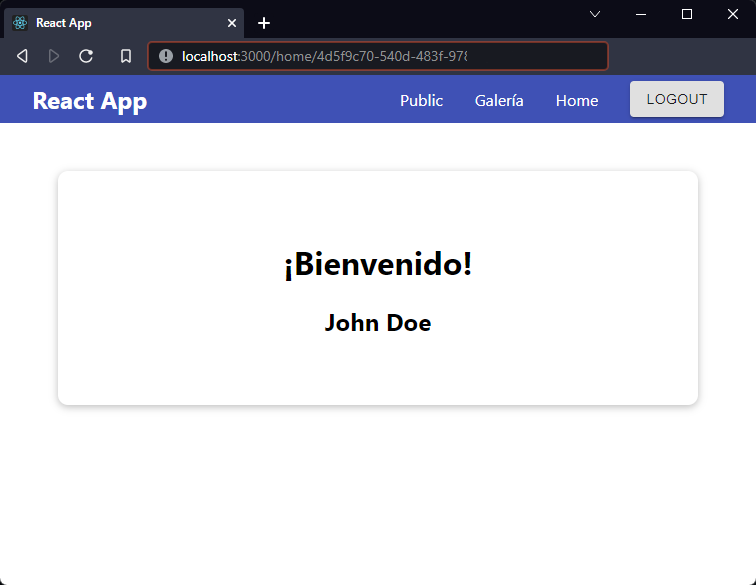

[`React`](../../README.md) > [`Sesión 07: React Router`](../Readme.md) > `Reto 02: Parámetros`

---

## Reto 02: Parámetros

### Objetivos

- Utilizar parámetros en el flujo de autenticación

### Desarrollo

En los dos últimos ejemplos hicimos una galería para demostrar cómo funcionan los parámetros y utilizar las distintas opciones que nos proporciona React Router para trabajar con dichos parámetros. Un escenario común es enviar el id de un usuario en la url a otro componente que debe extraerlo si desea obtener más información del usuario.

1. Como está construida la aplicación actualmente, si el usuario no está autenticado y quiere ir a `/home` será enviado primero a `/login`, después de autenticarse se envía de regreso a `/home`. En este proceso guardamos el id del usuario en `localStorage`. Realiza los cambios necesarios para enviar el id del usuario como parámetro de ruta, es decir, después de autenticarse el usuario debe ser enviado a `/home/:userId`.

2. En el componente `<Home>` en lugar de leer `userId` del `localStorage` debes extraer la variable de la url. Usa el `userId` de la url para obtener los datos del usuario con la petición HTTP.

3. Con este cambio, el nombre del usuario solo debe mostrarse si fue redirigido desde `/login`. Por lo que si el usuario va a `/` o `/gallery` y después regresa a `/home` ya no verá su nombre.

---

[Solución](./Solucion/Readme.md)
